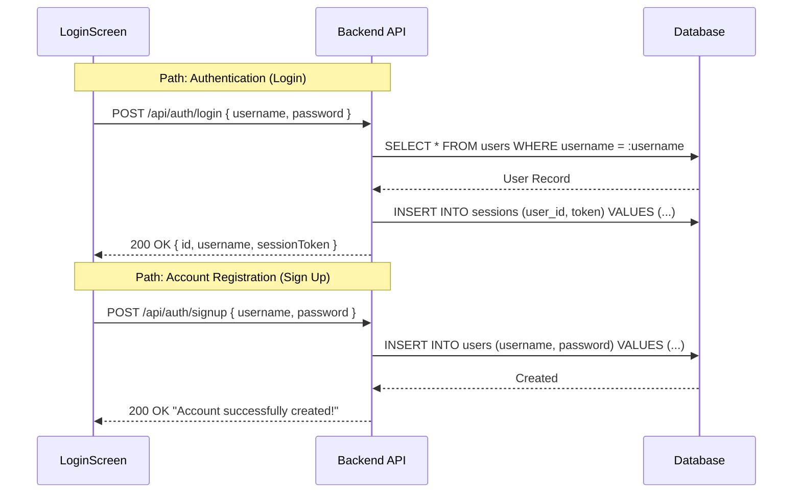
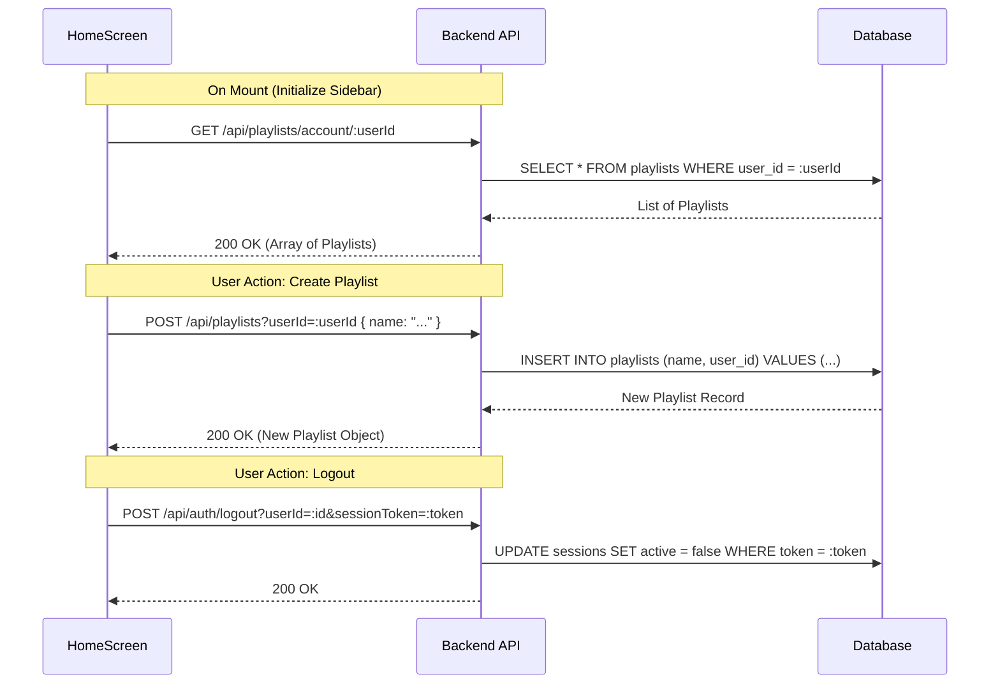
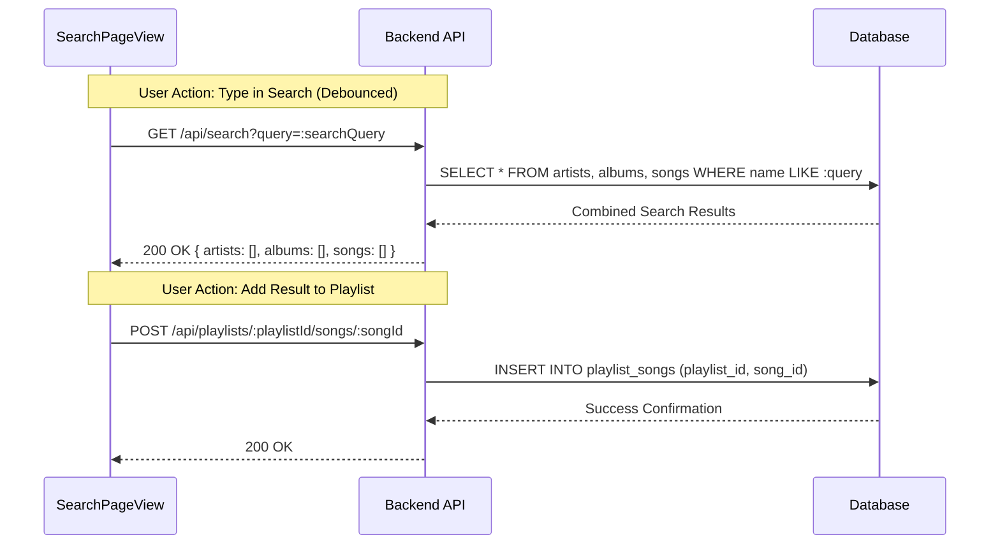
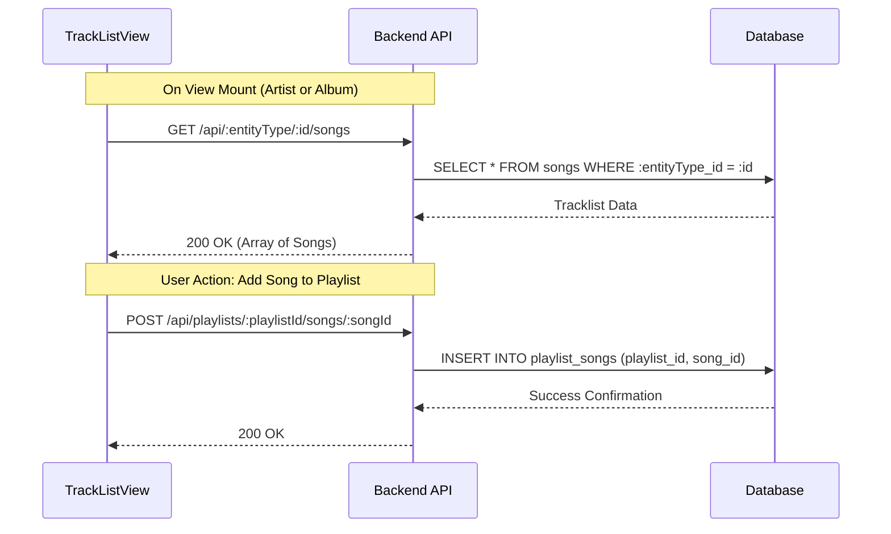
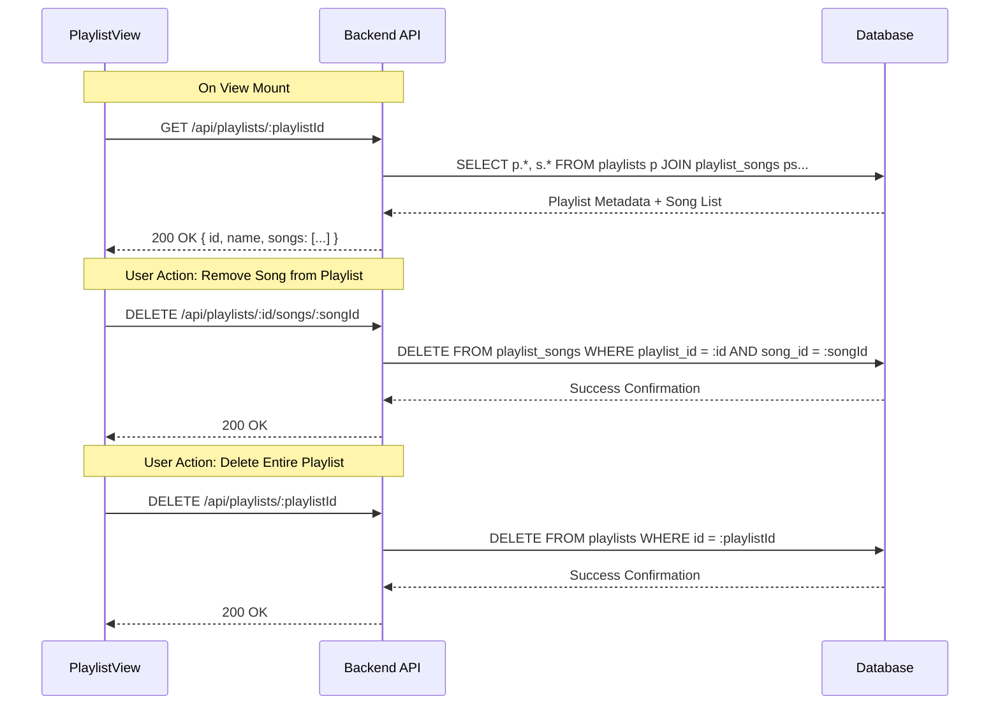

# REST API Message Path Map

This document maps every network interaction and the corresponding backend database operations initiated by the different screens and views within the application.

## 1. Login & Authentication
Handles user session lifecycle and account creation.

## 2. HomeScreen (Shell & Global Actions)
The shell handles global state, navigation, and core account-level resource management.

## 3. SearchPageView
Handles dynamic queries and the initial step of the "Add to Playlist" workflow.

## 4. TrackListView (Artists & Albums)
A generic view that fetches song collections based on a specific entity type.

## 5. PlaylistView
Manages detailed playlist interactions, including resource updates and deletions.

## Summary of Data Patterns

| Action Type | HTTP Method | DB Operation | Purpose |
| :--- | :--- | :--- | :--- |
| **Create** | `POST` | `INSERT` | New records (users, playlists, song associations). |
| **Read** | `GET` | `SELECT` | Retrieving catalog items, search results, or user data. |
| **Update** | `POST` / `PATCH` | `UPDATE` | Modifying existing records (session invalidation). |
| **Delete** | `DELETE` | `DELETE` | Removing resources or associations. |

---
*Documentation generated for notify-frontend architecture.*